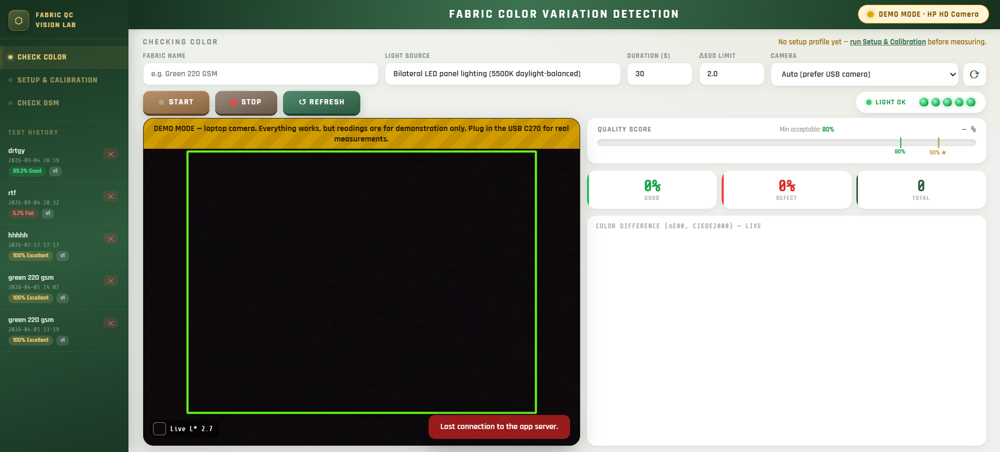

# Low-Cost Real-Time Fabric Color Variation Detection Using Computer Vision

A low-cost, real-time system that detects colour variation in dyed fabric using a
consumer USB webcam, daylight-balanced LED lighting and open-source software —
instead of a spectrophotometer.

**Live web demo:** https://researcher.mdraselkhandaker.com/demo.html
(a simplified browser version of the same method — indicative only; research
measurements are made with this Python desktop system)

**Author:** Md Rasel Khandaker<br>
Multimedia University, Malaysia



---

## What it does

- Compares every camera frame with a reference colour using **CIEDE2000**
  (ΔE00); ΔE\*ab (CIE76) and **ΔE CMC(2:1)** are recorded as well.
- Checks **five readiness conditions** before a test: camera ready, not too
  dark, not over-exposed, stable over time, and evenly lit across a 3 × 3 grid.
- **Setup & Calibration** page: measures the system's own noise on a uniform
  fabric and suggests a pass/fail limit above it (noise mean + 3 SD).
- Locks camera exposure and white balance after a 2 s adaptation period.
- Recognises the measurement camera by name. Any other camera (e.g. a laptop
  webcam) runs in **DEMO MODE**, and its reports are labelled as demo readings.
- Test reports with pass/fail verdict and per-frame CSV export
  (L\*, a\*, b\*, ΔE00, ΔE76, ΔE CMC).

## Hardware

| Component | Used in this work |
|---|---|
| Camera | Logitech C270 HD USB webcam (720p, 30 fps) |
| Lighting | Bilateral LED panels, 5500 K daylight-balanced |
| Computer | Any Windows laptop (Python 3.9+) |

## Installation

```bash
python -m venv venv
venv\Scripts\activate            # Windows   (macOS/Linux: source venv/bin/activate)
pip install -r requirements.txt
```

## Running

```bash
python desktop_app.py            # native desktop window (recommended)
python app.py                    # browser at http://127.0.0.1:5000
```

No camera available? A built-in simulator provides two virtual cameras:

```bash
set FCV_FAKE_CAMERA=1            # macOS/Linux: export FCV_FAKE_CAMERA=1
python desktop_app.py
```

## How to use

1. **Setup & Calibration** — place a uniformly dyed reference fabric, adjust
   camera and lights until all five checks are green, click **Measure
   baseline**, enter the distances and **Save setup**.
2. **Check Color** — enter the fabric name and press **START**. The reference
   colour is taken from 15 frames; every later frame is compared with it.
3. When the test ends, open the report or export it as CSV.

## Verifying the colour maths

```bash
python tests/verify_colorimetry.py
```

Checks the CIEDE2000 implementation against the published test data of
Sharma, Wu & Dalal (2005) and against the `colour-science` library.

## Project structure

```
├── app.py               # Flask routes, report/setup storage, CSV export
├── engine.py            # camera discovery, camera thread, checks, test and baseline (CONFIG)
├── colorimetry.py       # sRGB → CIELAB, CIEDE2000, CMC(l:c), CIE76
├── desktop_app.py       # native window launcher (pywebview)
├── tests/verify_colorimetry.py
├── templates/           # check_color, setup, report, check_gsm
└── static/              # css/style.css, js/main.js, js/color_check.js, js/setup.js
```

## Limitations

The webcam is not colorimetrically calibrated (sRGB/D65 is assumed), so absolute
L\*a\*b\* values are approximate. The system is designed for **relative** colour
differences under fixed lighting and locked camera settings.

## Related research

- M. R. Khandaker and S. P. A/P Thiagarajah, *Adoption of IoT-Enabled Quality
  Monitoring System in a Smart Factory*, 6th International Conference on
  Technology and Innovation Management (ICTIM 2026), Multimedia University. — presented
- *Low-Cost Real-Time Fabric Color Variation Detection Using Computer Vision* —
  manuscript in preparation (IEEE)

Researcher page: https://researcher.mdraselkhandaker.com